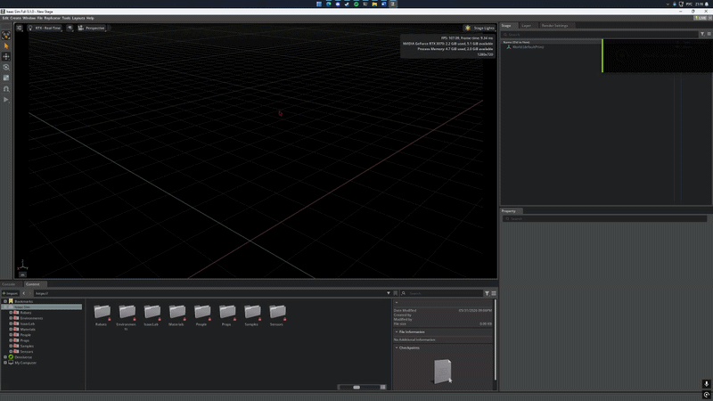
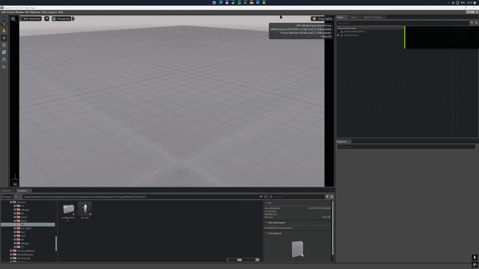
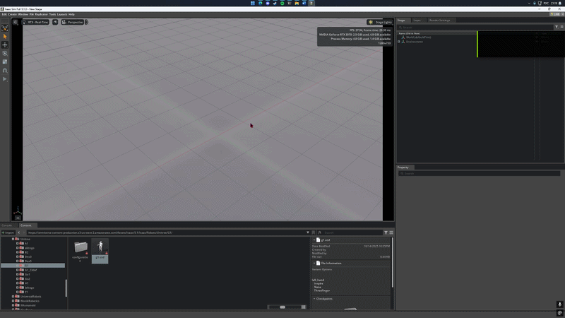
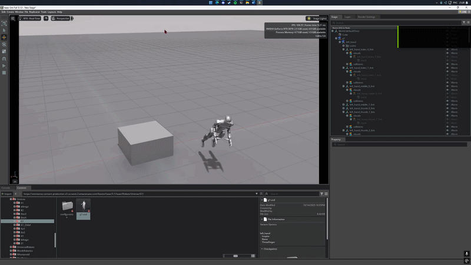
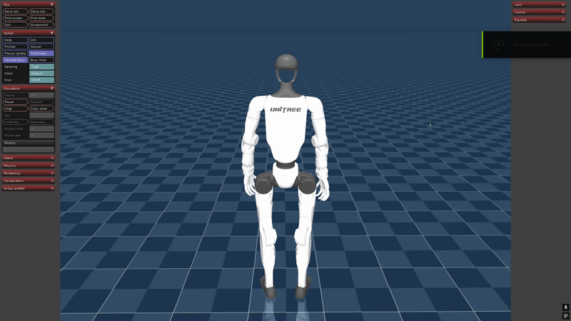
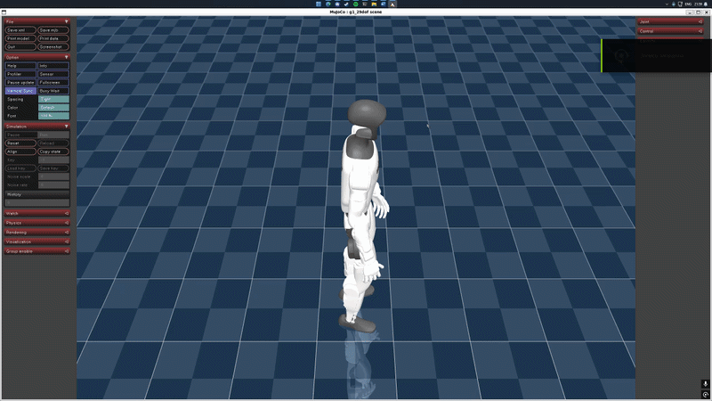

# Учебный курс (Работа с программным продуктом Isaac GR00T с использованием Isaac Sim и Isaac Lab)

Репозиторий содержит учебно-методические материалы и программные модули учебного курса по работе с обобщённой моделью управления роботами **Isaac GR00T** в средах **Isaac Sim** и **Isaac Lab**. Курс разработан в рамках дисциплины «Прикладные интеллектуальные системы» (Кафедра ИИТ, БрГТУ, 2026).

---

## Демонстрация работы

В рамках финального этапа курса реализован сценарий интерактивной локомоции робота-гуманоида Unitree G1 с клавиатуры (WASD) через программный интерфейс Whole-Body Control (WBC) в режиме свободной базы (`FREE_BASE`).

(https://youtu.be/9Uc-qmtLisw)

## Тексты лабораторных работ

<div id="lab1"></div>
<details>
<summary>📋 <b>Лабораторная работа №1: Разработка плана учебного курса по работе с Isaac GR00T</b></summary>

**Министерство образования Республики Беларусь** **Учреждение образования «Брестский государственный технический университет»** **Кафедра ИИТ** * **Дисциплина:** Прикладные интеллектуальные системы  
* **Тема:** Разработка плана учебного курса по работе с Isaac GR00T  
* **Выполнили:** Студенты 3 курса группы ИИ-26 Рубцов Д.А., Пилипук М.А.  
* **Проверил:** Савчук Ю.Н.  
* **Брест 2026** **Цель работы:** Разработать поэтапный план создания учебного курса по программному продукту Isaac GR00T, включающий анализ, проектирование и реализацию учебных материалов с использованием Isaac Sim и Isaac Lab.

### Ход работы

#### 1. Определение общей структуры
Процесс разработки курса разделяется на три основных последовательных этапа, каждый из которых представляет собой самостоятельный продукт и оформляется в виде отдельной лабораторной работы:

* **ЭТАП 1 — АНАЛИЗ (Лабораторная работа №2)**
  * **Название:** Анализ программных средств и сбор исходных данных
  * **Содержание:** Исследование структуры Isaac GR00T; анализ возможностей Isaac Sim; изучение Isaac Lab; анализ входных и выходных данных; определение структуры взаимодействия компонентов.
  * **Результат:** Сформированное системное понимание программных сред и подготовленные наборы данных для последующего проектирования.

* **ЭТАП 2 — ПРОЕКТИРОВАНИЕ (Лабораторная работа №3)**
  * **Название:** Проектирование учебных материалов
  * **Содержание:** Разработка сквозной структуры четырех практических занятий; формирование теоретических материалов; детальное проектирование заданий и контрольных вопросов.
  * **Результат:** Спроектированная дорожная карта курса и полностью готовые спецификации методических материалов.

* **ЭТАП 3 — РЕАЛИЗАЦИЯ (Лабораторная работа №4)**
  * **Название:** Разработка учебного курса
  * **Содержание:** Оформление полного курса; объединение теории и практики в единый гайд; проведение симуляционных экспериментов локомоции робота-гуманоида G1 с клавиатуры.
  * **Результат:** Готовый учебный интерактивный курс по Isaac GR00T с верифицированными сценариями WBC-телеоперации.

**Вывод:** В ходе работы разработан структурированный план создания учебного курса. План обеспечивает постепенное усложнение материала, отсутствие логических разрывов и пошаговую интеграцию нейросетевой модели управления с симуляционной физической средой.
</details>

<div id="lab2"></div>
<details>
<summary>📋 <b>Лабораторная работа №2: Анализ программных средств и сбор исходных данных</b></summary>

**Министерство образования Республики Беларусь** **Учреждение образования «Брестский государственный технический университет»** **Кафедра ИИТ** * **Дисциплина:** Прикладные интеллектуальные системы  
* **Тема:** Анализ программных средств и сбор исходных данных  
* **Выполнили:** Студенты 3 курса группы ИИ-26 Рубцов Д.А., Пилипук М.А.  
* **Проверил:** Савчук Ю.Н.  
* **Брест 2026** **Цель работы:** Провести практический анализ структуры Isaac GR00T, среды Isaac Sim и Isaac Lab, а также исследовать форматы данных и механизмы взаимодействия между компонентами системы.

**Задачи работы:**
1. Выполнить запуск базовой модели GR00T в режиме inference и проанализировать результаты.
2. Исследовать структуру входных и выходных векторов данных.
3. Оценить способы получения состояния робота в Isaac Sim GUI.
4. Сопоставить данные симуляции с входными интерфейсами модели.
5. Зафиксировать общую архитектуру взаимодействия компонентов.

### Теоретические сведения
Isaac GR00T функционирует как foundation-модель, преобразующая вектор текущего состояния робототехнической системы (наблюдения) в вектор целевых управляющих воздействий (действия). Для корректной интеграции необходимо обеспечить согласованность размерностей и форматов представления данных актуаторов симулятора и тензоров модели.

### Ход работы

#### 1. Запуск модели GR00T
Выполнен тестовый запуск inference с использованием стандартного конфигурационного скрипта:
```bash
python scripts/run_inference.py \
  --model checkpoints/groot_base.pt \
  --input data/sample_input.json \
  --output outputs/result.json

```

#### 2. Анализ входных данных

Файл `sample_input.json` имеет следующую структуру:

```json
{
  "observations": {
    "joint_positions": [0.0, 0.0, 0.0, 0.0, 0.0, 0.0],
    "joint_velocities": [0.0, 0.0, 0.0, 0.0, 0.0, 0.0]
  }
}

```

**Установлено:** Входные данные представлены в формате JSON в виде списков чисел с плавающей точкой (`float`). Размерность строго соответствует числу степеней свободы (`DoF`) целевого исполнительного механизма.

#### 3. Анализ выходных данных

Выходной файл `result.json` содержит сгенерированные моделью команды:

```json
{
  "actions": {
    "joint_targets": [0.12, -0.05, 0.03, 0.01, 0.07, -0.02]
  }
}

```

**Установлено:** Выходной вектор имеет идентичную входу размерность, значения представляют собой целевые углы суставов (`joint_targets`) для низкоуровневых PD-контроллеров.

#### 4. Проведение серии экспериментов

Были выполнены три тестовых запуска с различными входными данными:

* **Эксперимент 1 (Нулевые значения):** Выходные воздействия минимальны, система стремится к удержанию исходного статического состояния.
* **Эксперимент 2 (Случайные значения):** Выходные значения изменяются нелинейно, подтверждая сложную внутреннюю связность параметров модели.
* **Эксперимент 3 (Увеличенные/Экстремальные значения):** Выходные данные ограничиваются по диапазону, срабатывает внутренний эффект насыщения (защита от перегрузок).

#### 5. Анализ Isaac Sim (GUI)

В графическом интерфейсе симулятора создана тестовая сцена, добавлен робот-манипулятор и проверено изменение значений суставов через панель `Articulation Inspector`. Зафиксировано, что GUI предоставляет полный интерактивный доступ к `joint_positions` и `joint_velocities`.

#### 6. Анализ Isaac Lab

Установлено, что Isaac Lab предоставляет оптимизированные обертки над средами (`environments`) и реализует концепцию `policy` (управляющей политики), куда модель GR00T может интегрироваться напрямую в качестве готового агента нулевого переноса (`zero-shot policy`).

**Вывод:** Структура данных симуляции Isaac Sim полностью совместима с интерфейсами ввода-вывода Isaac GR00T. Проведенные эксперименты подтвердили нелинейный характер работы модели и наличие механизмов безопасного ограничения команд.
</details>

<div id="lab3"></div>
<details>
<summary>📋 <b>Лабораторная работа №3: Проектирование и разработка учебных материалов по работе с Isaac GR00T</b></summary>
**Министерство образования Республики Беларусь** **Учреждение образования «Брестский государственный технический университет»** **Кафедра ИИТ** * **Дисциплина:** Прикладные интеллектуальные системы

* **Тема:** Проектирование и разработка учебных материалов по работе с Isaac GR00T
* **Выполнили:** Студенты 3 курса группы ИИ-26 Рубцов Д.А., Пилипук М.А.
* **Проверил:** Савчук Ю.Н.
* **Брест 2026** **Цель работы:** На основе проведенного анализа спроектировать итоговую структуру учебного курса, сформировать теоретическое и практическое содержание четырех базовых занятий, подготовить контрольные вопросы.

### Ход работы

#### 1. Формирование структуры курса

Курс спроектирован в виде последовательного трека из 4-х занятий с линейным нарастанием сложности:

| № занятия | Название | Ключевое содержание |
| --- | --- | --- |
| **1** | Введение и базовый inference | Архитектура GR00T, CLI-интерфейс, форматы JSON |
| **2** | Освоение интерфейса Isaac Sim | Создание сцен в GUI, Articulation Inspector, USD-активы |
| **3** | Программная интеграция | Скриптовые мосты управления, цикл WBC, PYTHONPATH |
| **4** | Интерактивное WASD-управление | Задачи локомоции, режим FREE_BASE, анализ стабильности |

#### 2. Проектирование практических заданий и контроля

Для каждого занятия заложены обязательные практические кейсы:

* **Занятие 1:** Ручное варьирование JSON-файлов наблюдений, оценка эффекта насыщения модели.
* **Занятие 2:** Построение физической сцены с роботом и объектами, позиционирование звеньев через GUI.
* **Занятие 3:** Конфигурирование весов `motionbricks`, запуск скриптов низкоуровневой локомоции.
* **Занятие 4:** Реализация перехвата клавиатурных шорткатов на уровне X-сервера, проведение 3-х экспериментов по маневрированию робота G1.

#### 3. Верификация логики курса

Проведена сквозная проверка учебной программы на отсутствие методических разрывов. Установлено, что теоретическая база Занятия 1 и навыки манипулирования средой из Занятия 2 логически объединяются в программный комплекс в Занятии 3, а Занятие 4 выводит систему на уровень финального автономного продукта (интерактивного приложения).

**Вывод:** Спроектированный комплекс учебных материалов полностью готов к программной реализации. Структура заданий обеспечивает глубокое освоение как графических инструментов Isaac Sim, так и низкоуровневых интерфейсов управления нейросетевыми моделями.
</details>

<div id="lab4"></div>
<details>
<summary>📋 <b>Лабораторная работа №4: Учебный курс (Работа с программным продуктом Isaac GR00T с использованием Isaac Sim и Isaac Lab)</b></summary>
**Министерство образования Республики Беларусь** **Учреждение образования «Брестский государственный технический университет»** **Кафедра ИИТ** * **Дисциплина:** Прикладные интеллектуальные системы

* **Тема:** Учебный курс (Работа с программным продуктом Isaac GR00T с использованием Isaac Sim и Isaac Lab)
* **Выполнили:** Студенты 3 курса группы ИИ-26 Рубцов Д.А., Пилипук М.А.
* **Проверил:** Савчук Ю.Н.
* **Брест 2026** ---

### ЗАНЯТИЕ 1: Введение в Isaac GR00T и выполнение базового inference

**Цель занятия:** Изучение архитектуры модели Isaac GR00T, освоение процесса её запуска в изолированном CLI-режиме и анализ структуры входных и выходных векторов данных.

#### Теоретические сведения

Isaac GR00T — обобщенная нейросетевая модель (foundation model) управления роботами. На этапе inference она отображает вектор текущего состояния суставов робота (`joint_positions`, `joint_velocities`) в вектор целевых положений (`joint_targets`), не требуя дообучения под конкретную стандартную задачу.

#### Практическая часть

1. Инициализация изолированного окружения:
```bash
python3.10 -m venv groot_env
source groot_env/bin/activate
pip install --upgrade pip

```


2. Клонирование и локальная установка репозитория:
```bash
git clone [https://github.com/NVIDIA/Isaac-GR00T.git](https://github.com/NVIDIA/Isaac-GR00T.git)
cd Isaac-GR00T
pip install -r requirements.txt
pip install -e .

```


3. Выполнение базового inference:
```bash
python scripts/run_inference.py \
  --model checkpoints/groot_base.pt \
  --input data/sample_input.json \
  --output outputs/result.json

```


4. Верификация выходных векторов в `result.json` на соответствие спецификации степеней свободы робота.

#### Практические задания

1. Изменить значения входных параметров в файле `sample_input.json` и повторно выполнить inference.
2. Провести серию экспериментов с тремя типами входных данных: нулевые, случайные и экстремальные значения, зафиксировав диапазон выходных ответов.

#### Контрольные вопросы

1. Какова основная математическая функция модели Isaac GR00T?
2. Какие типы физических наблюдений составляют входной вектор модели?
3. В чём ключевое преимущество режима inference foundation-модели перед обучением с подкреплением (RL)?

---

### ЗАНЯТИЕ 2: Освоение интерфейса Isaac Sim и создание сцены (GUI-подход)

**Цель занятия:** Формирование устойчивых навыков работы с графической средой Omniverse Isaac Sim, импорт робототехнических USD-активов и интерактивное управление сочленениями через GUI.

#### Теоретические сведения

Isaac Sim использует иерархическую структуру описания сцен на базе формата USD (`Universal Scene Description`). Ключевыми понятиями являются: `Stage` (окно сцены), `Prim` (базовый объект/примитив) и `Articulation` (сборка робота, наделенная физическими связями и сочленениями).

#### Практическая часть

1. Запуск симулятора через `Omniverse Launcher`.
2. Создание пустой сцены (`File → New Stage`) и добавление физической поверхности (`Create → Physics → Ground Plane`).



3. Импорт робота из галереи ассетов (`Window → Isaac → Asset Browser`) методом Drag-and-Drop на сцену.



4. Добавление целевого объекта манипуляции (`Create → Shapes → Cube`) с настройкой его физических свойств (`Rigid Body`).



5. Запуск симуляции: запуск физического движка кнопкой `Play`.



6. Сохранение итогового файла сцены в формате `scene.usd`.

#### Практические задания

1. Перевести робота в произвольную нетипичную конфигурацию суставов и зафиксировать пространственные координаты конечного эффектора.
2. Эмпирическим путем определить, какие именно суставы оказывают наибольшее влияние на линейное отклонение рабочего органа по оси Z.

#### Контрольные вопросы

1. Чем отличается объект класса `Prim` со свойствами `Rigid Body` от статического примитива?
2. Какую роль выполняет панель `Articulation Inspector` в Isaac Sim?

---

### ЗАНЯТИЕ 3: Интеграция Isaac GR00T с Isaac Sim

**Цель занятия:** Освоение механизмов низкоуровневой интеграции предобученной модели с симуляционной средой через программные интерфейсы Whole-Body Control (WBC) без накладных расходов GUI.

#### Теоретические сведения

Для обеспечения высокой частоты выдачи команд управления (WBC) и минимизации задержек графическая оболочка отключается, а взаимодействие происходит через прямой скриптовый мост. Высокоуровневый цикл управления замыкается программно: опрос сенсоров симулятора $\rightarrow$ генерация контекстных признаков движения $\rightarrow$ вычисление углов 34 степеней свободы моделью GR00T $\rightarrow$ применение команд `qpos` к актуаторам робота.

#### Практическая часть

1. **Настройка окружения:** Изоляция потоков данных и исключение накладных расходов GUI-интерфейса Omniverse осуществляется за счет запуска через оптимизированный скриптовый мост локомоции.
2. **Проверка чекпоинтов:** Проверяется целостность локальных контрольных точек базовых подсетей движения: `motionbricks_vqvae`, `motionbricks_pose` и `motionbricks_root`, а также загружается сериализованная структура нейтрального положения суставов гуманоида G1 (`joints.p`).
3. **Запуск интеграционного скрипта интерактивной проверки:** Выполняется из корня репозитория с явным экспортом локальных путей модулей в интерпретатор:
```bash
PYTHONPATH=$PYTHONPATH:./motionbricks python3 motionbricks/scripts/interactive_demo_g1.py --result_dir ./motionbricks/out

```


4. **Анализ работы интерфейса:** Верификация работы функции автоматической генерации кадров движений (`generate_new_frames`) на основе дельта-времени шага симулятора.

#### Практические задания

1. Сконфигурировать переменные окружения `PYTHONPATH` и устранить конфликты версий зависимых пакетов (в частности, библиотеки квантования траекторий `vector_quantize_pytorch`).
2. Запустить скрипт интеграции и убедиться, что робот-гуманоид Unitree G1 успешно инициализируется в устойчивой вертикальной стойке (T-pose).

#### Контрольные вопросы

1. Почему стандартный GUI-режим Isaac Sim непригоден для задач высокочастотного управления WBC в реальном времени?
2. Какую роль выполняют подсети `motionbricks` в архитектуре интеграции GR00T?

---

### ЗАНЯТИЕ 4: Разработка собственной задачи интерактивной локомоции и проведение экспериментов

**Цель занятия:** Финальная сборка компонентов в единый программный продукт, реализация модуля телеоперации робота-гуманоида G1 с клавиатуры (WASD) и проведение серии симуляционных экспериментов.

#### Теоретические сведения

Полный замкнутый цикл функционирования системы реализует паттерн: *«симуляция $\rightarrow$ наблюдения $\rightarrow$ модель $\rightarrow$ управляющие воздействия $\rightarrow$ симуляция»*. Для реализации ручной телеоперации в реальном времени требуется организовать низкоуровневый перехват клавиатурных событий оператора (библиотека `Xlib` на уровне X-сервера) в обход стандартных обработчиков визуализатора, предотвращая конфликты горячих клавиш графического окна. Расчет динамического баланса WBC выполняется непрерывно в режиме свободной базы (`FREE_BASE`).

#### Практическая часть

1. **Формулирование задачи:** Создание сценария интерактивного ручного управления перемещением робота-гуманоида по плоскости с динамическим расчетом стабильности походки.
2. **Изоляция потока команд:** Внутри исполняемого файла активируется пассивная блокировка стандартных шорткатов визуализатора (`_disable_mujoco_keyboard_shortcuts`), изымающая буквенные клавиши под нужды локомоции.
3. **Интерактивный запуск:** Запуск симуляционной среды и ручное управление направлением и скоростью движения робота-гуманоида G1.

#### Практические задания

1. Реализовать и запустить задачу ручного интерактивного перемещения робота с клавиатуры: клавиши `W`/`S` — движение вперед/назад, `A`/`D` — развороты и латеральные смещения.
2. Провести серию из 3-х обязательных физических экспериментов с фиксацией стабильности походки:

* *Эксперимент 1:* Удержание состояния покоя под воздействием микрошумов симулятора.
  


* *Эксперимент 2:* Прямолинейная стабильная ходьба на дистанцию 5 метров.


 
* *Эксперимент 3:* Динамическое маневрирование со сменой вектора движения на 90 градусов.




3. Выполнить анализ стабильности удержания баланса таза (координаты `root/pelvis`) по результатам визуального контроля и графиков вывода WBC, сделав итоговый вывод о работоспособности модели.

#### Контрольные вопросы

1. Какие параметры и задержки в цикле обработки ввода сильнее всего влияют на успешность выполнения задачи интерактивного управления гуманоидом?
2. В чём заключаются фундаментальные физические ограничения базовой foundation-модели GR00T при управлении дискретными командами с клавиатуры?
3. В каких случаях для решения данной задачи интерактивной локомоции требуется дополнительное обучение политик с привлечением сред Isaac Lab?
</details>
